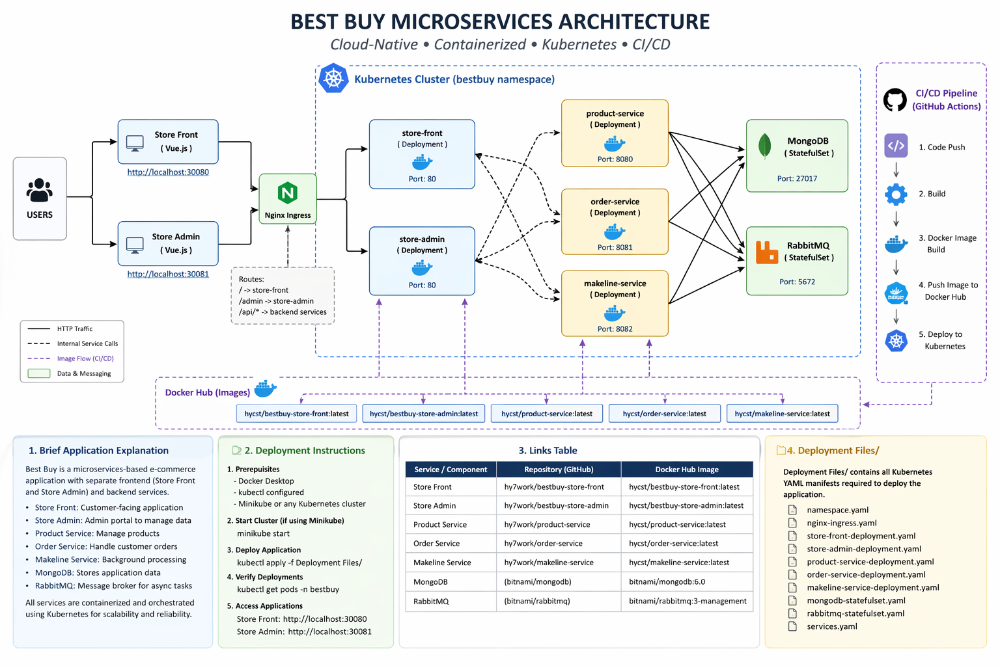

### cst8915project

  Best Buy Cloud-Native Microservices Application

### Overview

This project is a cloud-native microservices application developed for Best Buy. It is inspired by the Algonquin Pet Store (On Steroids) architecture and demonstrates modern cloud development practices including:

-  Microservices architecture
-  Containerization with Docker
-  Kubernetes orchestration
-  CI/CD with GitHub Actions
-  Scalable and modular design

The system consists of 5 microservices and a database, deployed in a Kubernetes environment.

###  Architecture Diagram

  

###  Application Architecture
####   Frontend Services
#####  Store-Front
-  Customer-facing web application
     Built with Vue.js
#####  Store-Admin
-  Admin portal for managing products and operations
-  Built with Vue.js
####   Backend Services
-  Product-Service
-  Manages product data
-  Order-Service
-  Handles order processing
-  Makeline-Service
-  Background worker for processing orders asynchronously
####   Data Layer
-  MongoDB (StatefulSet)
-  Stores application data

###  Key Features
Microservices-based architecture
Docker containerization for all services
Kubernetes deployment with:
Deployments
Services
ConfigMaps & Secrets
StatefulSets (MongoDB)
CI/CD pipelines using GitHub Actions
Automatic Docker image build and push
Scalable and modular design

 ### Deployment Note (IMPORTANT)

The original plan was to deploy this application to Azure Kubernetes Service (AKS). However, due to Azure subscription quota limitations, a Kubernetes cluster could not be provisioned.

- As a result, the application is deployed to a local Kubernetes cluster.

This still fully demonstrates:

-  Kubernetes orchestration
-  Containerized microservices
-  CI/CD automation
- Stateful workloads

The same Kubernetes manifests can be deployed to AKS with minimal changes when Azure resources are available.

### Deployment Instructions
#### Prerequisites
-  Docker Desktop
- Kubernetes enabled (Docker Desktop / Minikube)
-  kubectl installed
-  Git

##### Clone Repositories
-  git clone https://github.com/hy7work/bestbuy-store-front
-  git clone https://github.com/hy7work/bestbuy-store-admin
-  git clone https://github.com/hy7work/bestbuy-product-service
-  git clone https://github.com/hy7work/bestbuy-order-service
-  git clone https://github.com/hy7work/bestbuy-makeline-service
   ##### Deploy Kubernetes Resources
kubectl apply -f DeploymentFiles/
#####  Verify Deployment
kubectl get pods -n bestbuy
kubectl get services -n bestbuy
##### Access Applications
-   Store Front	http://localhost:30080
-   Store Admin	http://localhost:30081
   ###  I/CD Pipeline

Each microservice includes a GitHub Actions pipeline that:

-  Triggers on code push
-  Builds Docker image
-  Pushes image to Docker Hub
-   (Manual step) Deploys updated image to Kubernetes

Example Workflow
on: push

jobs:
  build-and-push:
    runs-on: ubuntu-latest
    steps:
      - uses: actions/checkout@v4

      - uses: docker/login-action@v3
        with:
          username: ${{ secrets.DOCKERHUB_USERNAME }}
          password: ${{ secrets.DOCKERHUB_TOKEN }}

      - uses: docker/build-push-action@v5
        with:
          push: true
          tags: hycst/bestbuy-store-admin:latest
#### Links Table
Service	GitHub Repository	Docker Hub Image
Store Front	https://github.com/hy7work/bestbuy-store-front
	hycst/bestbuy-store-front:latest
Store Admin	https://github.com/hy7work/bestbuy-store-admin
	hycst/bestbuy-store-admin:latest
Product Service	https://github.com/hy7work/bestbuy-product-service
	hycst/bestbuy-product-service:latest
Order Service	https://github.com/hy7work/bestbuy-order-service
	hycst/bestbuy-order-service:latest
Makeline Service	https://github.com/hy7work/bestbuy-makeline-service
	hycst/bestbuy-makeline-service:latest

### Deployment Files

All Kubernetes manifests are located in:

DeploymentFiles/

Includes:

-  namespace.yaml
-  store-front-deployment.yaml
-  store-admin-deployment.yaml
-  product-service.yaml
-  order-service.yaml
-  makeline-service.yaml
-  mongodb-statefulset.yaml
-  services.yaml
-  ingress.yaml

### Demo Video

- YouTube Link:

### CI/CD Demo Summary

The CI/CD pipeline was demonstrated by:

Modifying a frontend component
Committing and pushing code
Triggering GitHub Actions pipeline
Building and pushing Docker image
Restarting Kubernetes deployment
Verifying UI update in browser

### Project Highlights
Full microservices architecture
Kubernetes orchestration
CI/CD automation
Real-time deployment updates
Production-style system design

### Conclusion
-  This project demonstrates a complete cloud-native application lifecycle, from development to deployment, using modern DevOps and cloud technologies.
-  This application follows 12-Factor App principles and is designed for scalability, maintainability, and continuous delivery in cloud environments.
